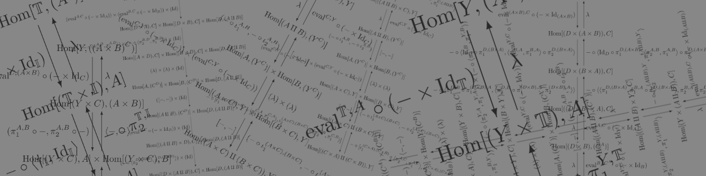

# Hom-set morphism generator for bicartesian closed categories



This is a little Scala-EDSL that enables the user to write down
chains of equalities that describe (iso)morphisms between
hom-sets in BCCC (bicartesian closed categories), from which it
then can reconstruct the complete (iso)morphisms between those
hom-sets.

It can also automatically apply the Yoneda lemma to extract
morphisms between objects given morphisms between their Yoneda
embeddings. Therefore, it is essentially a semi-automated
implementation of the general strategy described for example
in Awodey's *"Category Theory"* section 8.4
*"Applications of the Yoneda Lemma"*.

The basic idea is that if we can construct an isomorphism
between `Hom(A, X)` and `Hom(B, X)` that is natural in `X`, then
the Yoneda lemma gives us a way to construct an explicit
isomorphism between `A` and `B`. For example, in Proposition 8.6,
Awodey wants to show that

    A x (B U C) ~ (A x B) U (A x C)

holds *(here, `A`, `B`, `C` are some objects of a BCCC, and `x`, `U`, `~` 
are ugly ascii-art representations that stand for product,
coproduct, isomorphism respectively)*. In order to show this, he
writes down the following chain of isomorphic hom-sets:

    Hom(A x (B U C), X) ~ 
    Hom(B U C, X^A) ~
    (Hom(B, X^A) x Hom(C, X^A)) ~
    (Hom(A x B, X) x Hom(A x C, X)) ~
    Hom((A x B) U (A x C), X)

(again, up to differences in type-setting), and then applies the
Yoneda lemma corollary to obtain the isomorphism between `A x (B U C)`
and `(A x B) U (A x C)`. 

The present EDSL allows us to interpret the above chain of Hom-sets
literally as executable Scala code. It then fills out the gaps, replacing the
somewhat vague `~`-signs by explicit isomorphisms. Finally, it uses
the Yoneda lemma to convert those isomorphisms to isomorphisms between
underlying objects.

The interesting observation is that it is *much easier* to write down
chains of "types", and then let the "code" be generated automatically. This is
exactly the opposite of what happens with type inference where we write "code"
and then infer "types".  

A wall of examples follows.

-----

### Distributivity of product over coproduct (from right)


Scala code:


```scala

Hom((A U B) x C, Y) ~
Hom(A U B, Y^C) ~
(Hom(A, Y^C) x Hom(B, Y^C)) ~
(Hom(A x C, Y) x Hom(B x C, Y)) ~
Hom((A x C) U (B x C), Y)
  
```


Inferred canonical natural isomorphism between hom-sets:


Isomorphisms extracted using Yoneda lemma between objects `Prod[Coprod[A,B],C]` and `Coprod[Prod[A,C],Prod[B,C]]`:


```latex
 \varepsilon^{ C, ({  ({ A}\times{ C}) }\amalg{  ({ B}\times{ C}) }) }\circ \langle  [\lambda( \iota_1^{  ({ A}\times{ C}) ,  ({ B}\times{ C}) } ),\lambda( \iota_2^{  ({ A}\times{ C}) ,  ({ B}\times{ C}) } )]\circ \pi_1^{  ({ A}\amalg{ B}) , C} ,\pi_2^{  ({ A}\amalg{ B}) , C}\rangle 
```


```latex
[ \varepsilon^{ C, ({  ({ A}\amalg{ B}) }\times{ C}) }\circ \langle   \lambda( \textrm{Id}_{  ({  ({ A}\amalg{ B}) }\times{ C}) } )\circ \iota_1^{ A, B} \circ \pi_1^{ A, C} ,\pi_2^{ A, C}\rangle , \varepsilon^{ C, ({  ({ A}\amalg{ B}) }\times{ C}) }\circ \langle   \lambda( \textrm{Id}_{  ({  ({ A}\amalg{ B}) }\times{ C}) } )\circ \iota_2^{ A, B} \circ \pi_1^{ B, C} ,\pi_2^{ B, C}\rangle ]
```


-----
### Distributivity of product over coproduct (from left)


Scala code:


```scala

    Hom(C x (A U B), Y) ~
    Hom((A U B) x C, Y) ~
    Hom(A U B, Y^C) ~
    (Hom(A, Y^C) x Hom(B, Y^C)) ~
    (Hom(A x C, Y) x Hom(B x C, Y)) ~
    Hom((A x C) U (B x C), Y) ~
    Hom((C x A) U (C x B), Y)
  
```


Constructed canonical natural isomorphism:


Isomorphisms extracted using Yoneda lemma between objects `Prod[C,Coprod[A,B]]` and `Coprod[Prod[C,A],Prod[C,B]]`:


```latex
  \varepsilon^{ C, ({  ({ C}\times{ A}) }\amalg{  ({ C}\times{ B}) }) }\circ \langle  [\lambda(  [ \iota_1^{  ({ C}\times{ A}) ,  ({ C}\times{ B}) }\circ \langle \pi_2^{ A, C},\pi_1^{ A, C}\rangle , \iota_2^{  ({ C}\times{ A}) ,  ({ C}\times{ B}) }\circ \langle \pi_2^{ B, C},\pi_1^{ B, C}\rangle ]\circ \iota_1^{  ({ A}\times{ C}) ,  ({ B}\times{ C}) }  ),\lambda(  [ \iota_1^{  ({ C}\times{ A}) ,  ({ C}\times{ B}) }\circ \langle \pi_2^{ A, C},\pi_1^{ A, C}\rangle , \iota_2^{  ({ C}\times{ A}) ,  ({ C}\times{ B}) }\circ \langle \pi_2^{ B, C},\pi_1^{ B, C}\rangle ]\circ \iota_2^{  ({ A}\times{ C}) ,  ({ B}\times{ C}) }  )]\circ \pi_1^{  ({ A}\amalg{ B}) , C} ,\pi_2^{  ({ A}\amalg{ B}) , C}\rangle \circ \langle \pi_2^{ C,  ({ A}\amalg{ B}) },\pi_1^{ C,  ({ A}\amalg{ B}) }\rangle 
```


```latex
[  \varepsilon^{ C, ({ C}\times{  ({ A}\amalg{ B}) }) }\circ \langle   \lambda( \langle \pi_2^{  ({ A}\amalg{ B}) , C},\pi_1^{  ({ A}\amalg{ B}) , C}\rangle )\circ \iota_1^{ A, B} \circ \pi_1^{ A, C} ,\pi_2^{ A, C}\rangle \circ \langle \pi_2^{ C, A},\pi_1^{ C, A}\rangle ,  \varepsilon^{ C, ({ C}\times{  ({ A}\amalg{ B}) }) }\circ \langle   \lambda( \langle \pi_2^{  ({ A}\amalg{ B}) , C},\pi_1^{  ({ A}\amalg{ B}) , C}\rangle )\circ \iota_2^{ A, B} \circ \pi_1^{ B, C} ,\pi_2^{ B, C}\rangle \circ \langle \pi_2^{ C, B},\pi_1^{ C, B}\rangle ]
```


-----
### Iterated exponentiation


Scala code:


```scala

Hom(D, Exp(C, A x B)) ~
Hom(D x (A x B), C) ~
Hom(D x (B x A), C) ~
Hom((D x B) x A, C) ~
Hom(D x B, Exp(C, A)) ~
Hom(D, Exp(Exp(C, A), B))
  
```


Constructed canonical natural isomorphism:


Isomorphisms extracted using Yoneda lemma between objects `Exp[C,Prod[A,B]]` and `Exp[Exp[C,A],B]`:


```latex
\lambda( \lambda(    \varepsilon^{  ({ A}\times{ B}) ,C}\circ \langle \pi_1^{  ({ C}^{  ({ A}\times{ B}) }) ,  ({ A}\times{ B}) },\pi_2^{  ({ C}^{  ({ A}\times{ B}) }) ,  ({ A}\times{ B}) }\rangle \circ \langle \pi_1^{  ({ C}^{  ({ A}\times{ B}) }) ,  ({ B}\times{ A}) }, \langle \pi_2^{ B, A},\pi_1^{ B, A}\rangle\circ \pi_2^{  ({ C}^{  ({ A}\times{ B}) }) ,  ({ B}\times{ A}) } \rangle \circ \langle  \pi_1^{  ({ C}^{  ({ A}\times{ B}) }) , B}\circ \pi_1^{  ({  ({ C}^{  ({ A}\times{ B}) }) }\times{ B}) , A} ,\langle  \pi_2^{  ({ C}^{  ({ A}\times{ B}) }) , B}\circ \pi_1^{  ({  ({ C}^{  ({ A}\times{ B}) }) }\times{ B}) , A} ,\pi_2^{  ({  ({ C}^{  ({ A}\times{ B}) }) }\times{ B}) , A}\rangle\rangle  ) )
```


```latex
\lambda(    \varepsilon^{ A,C}\circ \langle   \varepsilon^{ B, ({ C}^{ A}) }\circ \langle \pi_1^{  ({  ({ C}^{ A}) }^{ B}) , B},\pi_2^{  ({  ({ C}^{ A}) }^{ B}) , B}\rangle \circ \pi_1^{  ({  ({  ({ C}^{ A}) }^{ B}) }\times{ B}) , A} ,\pi_2^{  ({  ({  ({ C}^{ A}) }^{ B}) }\times{ B}) , A}\rangle \circ \langle \langle \pi_1^{  ({  ({ C}^{ A}) }^{ B}) ,  ({ B}\times{ A}) }, \pi_1^{ B, A}\circ \pi_2^{  ({  ({ C}^{ A}) }^{ B}) ,  ({ B}\times{ A}) } \rangle, \pi_2^{ B, A}\circ \pi_2^{  ({  ({ C}^{ A}) }^{ B}) ,  ({ B}\times{ A}) } \rangle \circ \langle \pi_1^{  ({  ({ C}^{ A}) }^{ B}) ,  ({ A}\times{ B}) }, \langle \pi_2^{ A, B},\pi_1^{ A, B}\rangle\circ \pi_2^{  ({  ({ C}^{ A}) }^{ B}) ,  ({ A}\times{ B}) } \rangle  )
```


-----
### Product of exponents


Scala code:


```scala

Hom(Y, (C^A) x (C^B)) ~
(Hom(Y, C^A) x Hom(Y, C^B)) ~
(Hom(Y x A, C) x Hom(Y x B, C)) ~
(Hom(A x Y, C) x Hom(B x Y, C)) ~
(Hom(A, C^Y) x Hom(B, C^Y)) ~
Hom(A U B, C^Y) ~
Hom((A U B) x Y, C) ~
Hom(Y x (A U B), C) ~
Hom(Y, C^(A U B))
  
```


Constructed canonical natural isomorphism:


Isomorphisms extracted using Yoneda lemma between objects `Prod[Exp[C,A],Exp[C,B]]` and `Exp[C,Coprod[A,B]]`:


```latex
\lambda(   \varepsilon^{  ({  ({ C}^{ A}) }\times{  ({ C}^{ B}) }) ,C}\circ \langle  [\lambda(   \varepsilon^{ A,C}\circ \langle  \pi_1^{  ({ C}^{ A}) ,  ({ C}^{ B}) }\circ \pi_1^{  ({  ({ C}^{ A}) }\times{  ({ C}^{ B}) }) , A} ,\pi_2^{  ({  ({ C}^{ A}) }\times{  ({ C}^{ B}) }) , A}\rangle \circ \langle \pi_2^{ A,  ({  ({ C}^{ A}) }\times{  ({ C}^{ B}) }) },\pi_1^{ A,  ({  ({ C}^{ A}) }\times{  ({ C}^{ B}) }) }\rangle  ),\lambda(   \varepsilon^{ B,C}\circ \langle  \pi_2^{  ({ C}^{ A}) ,  ({ C}^{ B}) }\circ \pi_1^{  ({  ({ C}^{ A}) }\times{  ({ C}^{ B}) }) , B} ,\pi_2^{  ({  ({ C}^{ A}) }\times{  ({ C}^{ B}) }) , B}\rangle \circ \langle \pi_2^{ B,  ({  ({ C}^{ A}) }\times{  ({ C}^{ B}) }) },\pi_1^{ B,  ({  ({ C}^{ A}) }\times{  ({ C}^{ B}) }) }\rangle  )]\circ \pi_1^{  ({ A}\amalg{ B}) ,  ({  ({ C}^{ A}) }\times{  ({ C}^{ B}) }) } ,\pi_2^{  ({ A}\amalg{ B}) ,  ({  ({ C}^{ A}) }\times{  ({ C}^{ B}) }) }\rangle \circ \langle \pi_2^{  ({  ({ C}^{ A}) }\times{  ({ C}^{ B}) }) ,  ({ A}\amalg{ B}) },\pi_1^{  ({  ({ C}^{ A}) }\times{  ({ C}^{ B}) }) ,  ({ A}\amalg{ B}) }\rangle  )
```


```latex
\langle \lambda(   \varepsilon^{  ({ C}^{  ({ A}\amalg{ B}) }) ,C}\circ \langle   \lambda(   \varepsilon^{  ({ A}\amalg{ B}) ,C}\circ \langle \pi_1^{  ({ C}^{  ({ A}\amalg{ B}) }) ,  ({ A}\amalg{ B}) },\pi_2^{  ({ C}^{  ({ A}\amalg{ B}) }) ,  ({ A}\amalg{ B}) }\rangle \circ \langle \pi_2^{  ({ A}\amalg{ B}) ,  ({ C}^{  ({ A}\amalg{ B}) }) },\pi_1^{  ({ A}\amalg{ B}) ,  ({ C}^{  ({ A}\amalg{ B}) }) }\rangle  )\circ \iota_1^{ A, B} \circ \pi_1^{ A,  ({ C}^{  ({ A}\amalg{ B}) }) } ,\pi_2^{ A,  ({ C}^{  ({ A}\amalg{ B}) }) }\rangle \circ \langle \pi_2^{  ({ C}^{  ({ A}\amalg{ B}) }) , A},\pi_1^{  ({ C}^{  ({ A}\amalg{ B}) }) , A}\rangle  ),\lambda(   \varepsilon^{  ({ C}^{  ({ A}\amalg{ B}) }) ,C}\circ \langle   \lambda(   \varepsilon^{  ({ A}\amalg{ B}) ,C}\circ \langle \pi_1^{  ({ C}^{  ({ A}\amalg{ B}) }) ,  ({ A}\amalg{ B}) },\pi_2^{  ({ C}^{  ({ A}\amalg{ B}) }) ,  ({ A}\amalg{ B}) }\rangle \circ \langle \pi_2^{  ({ A}\amalg{ B}) ,  ({ C}^{  ({ A}\amalg{ B}) }) },\pi_1^{  ({ A}\amalg{ B}) ,  ({ C}^{  ({ A}\amalg{ B}) }) }\rangle  )\circ \iota_2^{ A, B} \circ \pi_1^{ B,  ({ C}^{  ({ A}\amalg{ B}) }) } ,\pi_2^{ B,  ({ C}^{  ({ A}\amalg{ B}) }) }\rangle \circ \langle \pi_2^{  ({ C}^{  ({ A}\amalg{ B}) }) , B},\pi_1^{  ({ C}^{  ({ A}\amalg{ B}) }) , B}\rangle  )\rangle
```


-----
### Exponent of products


Scala code:


```scala

Hom(Y, (A x B)^C) ~
Hom(Y x C, A x B) ~
(Hom(Y x C, A) x Hom(Y x C, B)) ~
(Hom(Y, A^C) x Hom(Y, B^C)) ~
Hom(Y, (A^C) x (B^C))
  
```


Generated canonical natural isomorphism:


Isomorphisms extracted using Yoneda lemma between objects `Exp[Prod[A,B],C]` and `Prod[Exp[A,C],Exp[B,C]]`:


```latex
\langle \lambda(  \pi_1^{ A, B}\circ  \varepsilon^{ C, ({ A}\times{ B}) }\circ \langle \pi_1^{  ({  ({ A}\times{ B}) }^{ C}) , C},\pi_2^{  ({  ({ A}\times{ B}) }^{ C}) , C}\rangle   ),\lambda(  \pi_2^{ A, B}\circ  \varepsilon^{ C, ({ A}\times{ B}) }\circ \langle \pi_1^{  ({  ({ A}\times{ B}) }^{ C}) , C},\pi_2^{  ({  ({ A}\times{ B}) }^{ C}) , C}\rangle   )\rangle
```


```latex
\lambda( \langle  \varepsilon^{ C,A}\circ \langle  \pi_1^{  ({ A}^{ C}) ,  ({ B}^{ C}) }\circ \pi_1^{  ({  ({ A}^{ C}) }\times{  ({ B}^{ C}) }) , C} ,\pi_2^{  ({  ({ A}^{ C}) }\times{  ({ B}^{ C}) }) , C}\rangle , \varepsilon^{ C,B}\circ \langle  \pi_2^{  ({ A}^{ C}) ,  ({ B}^{ C}) }\circ \pi_1^{  ({  ({ A}^{ C}) }\times{  ({ B}^{ C}) }) , C} ,\pi_2^{  ({  ({ A}^{ C}) }\times{  ({ B}^{ C}) }) , C}\rangle \rangle )
```


-----
### The rule \(A^1 = A\)


Scala code:


```scala

Hom(Y, A^Terminal) ~
Hom(Y x Terminal, A) ~
Hom(Y, A)
  
```


Generated canonical natural isomorphism:


Isomorphisms extracted using Yoneda lemma between objects `Exp[A,Terminal]` and `A`:


```latex
  \varepsilon^{ \mathbb{T},A}\circ \langle \pi_1^{  ({ A}^{ \mathbb{T}}) , \mathbb{T}},\pi_2^{  ({ A}^{ \mathbb{T}}) , \mathbb{T}}\rangle \circ \langle \textrm{Id}_{  ({ A}^{ \mathbb{T}}) },\dagger_{  ({ A}^{ \mathbb{T}}) }\rangle 
```


```latex
\lambda( \pi_1^{ A, \mathbb{T}} )
```


-----
### The rule \(A^0 = 1\)


Scala code:


```scala

Hom(Terminal, A^Initial) ~
Hom(Terminal x Initial, A) ~
Hom(Initial, A)
  
```


Here, we cannot (and need not) use the Yoneda-lemma. Instead, we simply apply the inverse of the above natural isomorphism to the morphism `!_A`, and obtain a morphism from the terminal object to `A^{\mathbb{I}}`. Hence we obtain that `A^{\mathbb{I}}` must be isomorphic to the terminal object.


```scala
InitMor[A]

Lambda[Terminal,Initial,A]((
InitMor[A] o 
P2[Terminal, Initial]))
```


-----
### Analogon of the disjunction elimination


Scala code:


```scala

(Hom(D, C^A) x Hom(D, C^B) x Hom(D, A U B)) ~
(Hom(D x A, C) x Hom(D x B, C) x Hom(D, A U B)) ~
(Hom(A x D, C) x Hom(B x D, C) x Hom(D, A U B)) ~
(Hom(A, C^D) x Hom(B, C^D) x Hom(D, A U B)) ~
(Hom(A U B, C^D) x Hom(D, A U B)) ~
(Hom((A U B) x D, C) x Hom(D, A U B)) ~
(Hom(D x (A U B), C) x Hom(D, A U B)) ~
(Hom(D, C^(A U B)) x Hom(D, A U B)) ~
Hom(D, (C^(A U B)) x (A U B)) ->
Hom(D, C)
  
```


Generated morphism:


-----

### Generating this readme

This readme has been generated automatically using

    scala bccc_morphism_construction.scala > README.md

To look at it locally, you might want to run

    markdown README.md > readme.html && firefox readme.html
